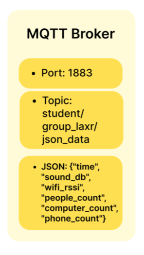

# Can I Work There?

## Prerequisites

### Unity Development Environment
| Component | Version / Details |
| :--- | :--- |
| **Engine** | Unity 6000.0.62f1 |
| **AR Core** | AR Foundation, AR Subsystems, ARCore XR Plugin |
| **Tools** | XR Interaction Toolkit, Mobile AR Template Assets |
| **Plugins** | M2MQTT, XCharts, TextMesh Pro, Lean Touch |

### Arduino Embedded System
| Component | Details |
| :--- | :--- |
| **IDE** | Arduino IDE 2.3.6 |
| **Network** | `WiFiNINA`, `WiFi`, `PubSubClient` |
| **Hardware** | `Servo`, `Adafruit_NeoPixel` |
| **Utils** | `ArduinoJson`, `vector`, `map`, `time.h`, `soc.h` |

## 1. Project Overview

The project focuses on the noise level, the Wi-Fi signal strength, and the occupancy level of a working or studying environment, facilitating people to make ideal decisions on workspaces.

## 2. Background and Motivation

People often seek to assess the condition at public study and work environments before they depart, such as university spaces or public libraries, to optimise their workspace selection. People have different desired working conditions for different purposes. For instance, someone intends to find a quiet space for reading, while someone prefers to work collaboratively with decent internet signal and tolerance for noise.

This *Can I Work There* project with real-time sensing data therefore becomes the perfect solution to increase the convenience and efficiency to understand the condition and make informed decisions about where to work or study, avoiding unsuitable environments.


## 3. Physical Data Device

### 3.1.1 Hardware Components

<div align="left">
  
</div>


The system simultaneously monitors sound environments and wireless network strength to offer an overall picture of the workspace. The schematics of circuit connection are shown below. Both sound intensity and signal strength (RSSI) of Wi-Fi are considered as the primary parameters for environmental analysis.

<div align="center">
  
  <p><em>Figure1: Gauge box and sensor box circuit schematic</em></p>
</div>

## 3.2 Data Integrating and Signal Processing

### 3.2.1 Sound Sensing and Noise Immunity

The system uses a **MAX9814** sound sensor that does high frequency sampling (all 50ms). In order to extract stable background noise from transient acoustic impulses, such as the dropping of a pen, or transient mechanical vibrations, the following signal conditioning techniques are used:

* **Hardware Gain Configuration**: To optimize sensitivity for quiet environments like libraries, the sensor is configured with a **60dB gain**. The resulting analog signals are mapped to a calibrated decibel range of **30dB to 90dB**.
* **Time-Window Averaging**: A rolling average is calculated every 5 seconds over approximately 100 samples to ensure data stability and suppress outliers. The processing follows the formula:
  * $vg = \frac{\sum_{i=1}^{n} \text{dB}_i}{n}$
* **Environmental Benchmarking**: The system is based on research by Mehta, Zhu, and Cheema (2012) that evaluates the "Golden Noise Range." While levels around 70dB can help you be creative, noise levels over 85dB, when sustained over time, greatly degrade your ability to focus on cognitive tasks. Our system assists in helping the user determine the best balance for productivity.

### 3.2.2 Wi-Fi Telemetry and Occupancy Inference

Apart from acoustic information, the ESP32 also periodically performs network scans to assess the proximal digital infrastructure:

* **RSSI Monitoring:** The system specifically tracks the Received Signal Strength Indicator (RSSI) of the "eduroam" network which is the standard SSID used in all university facilities.
* **Spatial Correlation:** RSSI values can be used as a proxy for the proximity of the device to access points, and combining this with acoustic data allows you to infer the density of the crowd and other dynamic physical characteristics of the study area.

---

### 3.2.3 Mechanical Visualisation Logic

The processed noise data is translated into physical feedback via a servo-driven pointer mechanism. The `updateServo` function manages this transition through specific mapping and mechanical compensation:

1. **Normalisation**: The filtered sound data (30dB–90dB) is firstly normalized into a linear progress percentage (0.0 to 1.0):
   * $\text{progress} = \frac{\text{safeDB} - 30.0}{60.0}$
2. **Angular Mapping**: This percentage is mapped across the **270-degree physical dial**.
3. **Mechanical Gear Compensation**: Since the servo is coupled to the pointer via a gear train with a **14:30 ratio**, the software applies a compensatory adjustment to the rotation angle:
   * $\text{targetPointerAngle} = \text{progress} \times 270.0$
   * $\text{servoAngle} = \text{targetPointerAngle} \times \left(\frac{14.0}{30.0}\right)$
4. **Operational Constraints**: The servo movement is restricted to a safe range (0 to 140 degrees) to prevent mechanical strain while ensuring high-fidelity tracking of real-time noise levels.

---

### 3.2.4 People count detection

#### 1. Physical Data Device
The people count is detected by scanning RSSI(Radio Signal Strength Indicator) released by devices while scanning for WIFI or Bluetooth even if the hotspot is not on. The MAC(Media Access Control) address of the devices can be fetched, the prefix of which is defined by the brand, known as OUI(Organizationally Unique Identifier), assigned to the manufacturer (brand) by the IEEE Registration Authority. Also, it is possible to discern phone or laptop by the RSSI strength, and the individual or group address and universal or local administration by the least 2 bits. The mobile signals have more variation and laptop signals are stronger(IEEE Registration Authority, 2022). The version in use relies on a heuristic approach rather than a rigorous analysis, providing a rough estimate.

##### 1.1 MAC prefix analysis
The OUI are fetched from GitHub, IEEE OUI list and MAC address searching portal(iamckn, n.d.; IEEE Registration Authority, n.d.-a; MACAddress.io, n.d.).

##### 1.2 Object-oriented programming
Object-oriented programming is applied by defining class `DeviceTypeDetector`, `EnhancedPeopleCounter`, and `BehavioralAnalyzer`. 

##### 1.2.1 DeviceTypeDetector

The `DeviceTypeDetector` class contains a public function, `detectDeviceType`, which identifies Apple devices—such as iPhone, MacBook, or iPad—by their OUI and returns a string. Within this function, a nested function, `guessBySignalCharacteristic`s, infers device types based on RSSI patterns. The public function `getVendorFromMAC` takes first 8 characters, returning the company label if the OUI matches. The public function `guessAppleDeviceType` distinguishes the Apple devices based on RSSI strength and the least bit. Zero for individual address, one for group address. So the code uses a heuristic threshold (> −45 dBm) of only individual address with Apple OUI and defines them as iphone(IEEE Registration Authority, 2022; MetaGeek, n.d.). The private function `getMacSuffix` gets the last few digits of MAC address as feature and is only used in `guessAppleDeviceType`. 

##### 1.2.2 EnhancedPeopleCounter
The class `EnhancedPeopleCounter` has private object DeviceInfo with fields mac(MAC address), type, rssi, firstSeen(timestamp), lastSeen(timestamp), and scanCount. Then there is a dynamic list deviceHistory that stores DeviceInfo items. It updates each time a new device is detected. Another object `DeviceTypeDetector` is a member created from another class. 

The public function `analyzeDevices` is using the function `classifyDevice` to classify the device types by defining very-strong-signals-non-Apple devices as computers, RSSI -60~-40 as mobile phones. The `guessAppleDeviceType` function determines Apple device types. The function `isLikelyRouter` detect routers. The `estimatePeople` uses the maximum of phoneCount and computerCount.


##### 1.2.3 BehaviorAnalyzer
The class `BehaviorAnalyzer` defines an object `SignalBehavior` with mac, `minRSSI`, `maxRSSI`, `variance(maxRSSI-minRSSI)`, `isMobile`(true if variance > 15). Then it defines a hashmap of string mapping to object `SignalBehavior` named `behaviorHistory`. Then 2 public functions are defined, `trackDeviceBehavior` using MAC address and RSSI to determine a device of RSSI signal variance over 15 as mobile phone. The function `analyzeMobility` is using MAC address to distinguish between portable or stationary. 

##### 1.2.4 Initiation and Calling
Then `EnhancedPeopleCounter` and `BehavioralAnalyzer` are initiated as `peopleCounter` and `behaviorAnalyzer` and the `peopleCounter.analyzeDevices` is called in loop for detecting each device for our dashboard. 
### 3.2.5 Connectivity and Data Transmission

Every 5 seconds, the system encapsulates the processed environmental metrics into a standardized **JSON payload** for transmission via the **MQTT protocol**.

* **NTP Temporal Synchronization**: As the ESP32 lacks a persistent internal clock, the system synchronizes with an **NTP (Network Time Protocol)** server. This ensures that every data point is accurately timestamped (e.g., `2023-11-15 14:05:01`), allowing for the analysis of long-term environmental trends.
* **Multidimensional Data Structure**: The telemetry package includes:
    * `sound_db`: The averaged noise level.
    * `wifi_rssi`: The network signal strength.
    * `people_count`: The estimated people of the area.
    * `computer_count` & `phone_count`: The number of computers and phones in that space.

**Example JSON:**

```json
{
  "time": "2023-11-15 14:05:01",
  "sound_db": 45.2,
  "wifi_rssi": -62,
  "people_count": 12,
  "computer_count": 4,
  "phone_count": 8
}
```

## 4. Enclosure Design
The gauge enclosure is using the **round corner** which ensures **safety and comfort** for people, **strength and durability** by spreading the load, adding **suitability for molding** for plastics because fillets help plastic flow smoothly, reduce weld lines, and avoid thick/thin transitions. Although it was **3D printed with PLA**, it can also be manufactured with plastic molding for future large-scale producing. Round corners are also a **visual signal of friendliness and approachability**. There are custom-designed internal mounting enclosures integrated into the gauge housing for the servo, gears, and the MKR1010 board. A 32mm diameter gear is mounted on the servo, which meshes with a 16mm gear at the center of the dial, effectively increasing the servo's rotation range.
<div align="center">
  
  <p><em>Figure2: 3D model of the gauge box</em></p>
</div>

<div align="center">
  
  <p><em>Figure3: 3D model of the gauge box</em></p>
</div>

The noise level dial features a classic red-green color scheme. Within the 270-degree rotation range, the pointer rotates clockwise as noise levels increase. 
<div align="center">
  
  <p><em>Figure4: Guage presenting the real-time noise level with typical noise level conditions on the dial</em></p>
</div>

The 3D printed sensor box was adapted from an open-source model available online (Moews, 2012). It consists of a decorative enclosure with a removable lid, featuring a hexagonal pattern. These perforations not only allow the power cable and sensor microphone to extend outward but also enhance the attractiveness and quality of the sensor box.
<div align="center">
  
  <p><em>Figure5: Sensor box</em></p>
</div>


## 5. Digital Twin Implementation

<div align="center">
  
  <p><em>Figure6: illustrates the entire digital twin system</em></p>
</div>

### 5.1 AR Tracking and Spatial Anchoring

The system uses Unity’s *ARTrackedImageManager* to detect a printed physical marker (Target Card) placed within the monitored environment. Once the marker is recognised, the *Dashboard_New* prefab is instantiated and anchored to the marker’s coordinate frame, ensuring stable visual alignment between digital information and the physical space. This workflow follows the CASA0019 Unity AR workshop structure (CASA0019, 2025), which adopts image-based prefab instantiation as the core tracking mechanism.

<div align="center">
  
  <p><em>Figure7: illustrates the target card generated by Gemini.</em></p>
</div>




### 5.2 Real-Time Data Integration via MQTT


Real-time sensor data is transmitted using an MQTT publish–subscribe pipeline, following the structure introduced in CASA0019 Workshops 03, 06 and 07 (CASA, 2025). JSON messages are received through M2MQTT and handled via a producer–consumer pattern, where the MQTT callback thread enqueues messages and the Unity main thread dequeues and updates the dashboard. All UI updates run on the main thread to avoid race conditions and maintain stable real-time AR visualisation.

### 5.3 Dashboard Layout and Visual Design

The AR dashboard follows an **information hierarchy layout**, helping users locate critical signals efficiently (Cluster Design, 2025).

The dashboard was implemented as a **modular UI structure**, allowing individual visual components (gauges, charts, indicators) to be updated independently without affecting overall system performance.

<div align="center">
  
  <p><em>Figure8: illustates the layout structure of dashboard .</em></p>
</div>


To avoid competing with the physical environment, the interface employs semi-transparent panels, soft colours and rounded shapes. Important information is emphasised through clear typographic hierarchy and contrast, and proportional scaling maintains readability across mobile devices.

### 5.4 Visualisation and Interpretation

#### 5.4.1 Dual-Mode Data Visualisation
To support both immediate awareness and longer-term understanding, the system provides two temporal views:

* **Real-time Trend:** Displays a rolling one-minute window of Wi-Fi and noise data, capturing short-term environmental fluctuations
* **24-Hour Overview:** Presents longer-term trends to highlight recurring patterns such as peak noise periods

As the sensing device does not currently implement local data storage, the 24-hour view uses simulated data to demonstrate full system functionality and visual behaviour.

<figure style=" margin:  0 10px 10px; width: 160px;">
  
</figure>

#### 5.4.2 Quadrant-Based Environmental Classification

To bridge the gap between raw sensor data and user-facing interpretation, a lightweight logic layer based on quadrant classification was introduced. The model combines ambient noise level and Wi-Fi signal strength to generate contextual, non-prescriptive recommendations. The active quadrant is highlighted through colour flash and textual prompts, enabling users to interpret environmental conditions within seconds.


#### 5.4.2.1 Classification Thresholds
* **Wi-Fi signal strength threshold:** –57 dBm
* **Ambient noise threshold:** 50 dB


<br clear="all" />

## 6. How To Use


1. **Prepare the Physical System**  
   Power on the sensing device and ensure that it is connected to the local network and publishing JSON-formatted data to the MQTT broker (`mqtt.cetools.org`).

2. **Launch the Application**  
   Open the compiled Android AR application on an ARCore-compatible mobile device and grant camera permissions.

3. **Start the AR Session**  
   The application automatically enters scanning mode upon launch.

4. **Scan the Target Marker**  
   Point the camera at the printed Target Card placed within the monitored space.  
   Once detected, the AR dashboard is instantiated and anchored at the marker.

5. **Observe Live Updates**  
   - Numerical indicators and the noise gauge update in real time  
   - Charts display both short-term fluctuations and long-term trends  
   - The quadrant indicator highlights the current environmental classification and recommended activities

6. **Interact with the Dashboard**  
   Pinch gestures (via Lean Touch) allow users to scale the dashboard for either close inspection or overview.

## 7. Limitations and Future Development

This project has several limitations. The MAX9814 sound sensor employs a fixed 60 dB gain optimised for low-level noise detection, which restricts its ability to accurately capture sudden loud noises and rapidly changing sound environments. The existing people count detection uses a simple approach based on Apple OUI and RSSI signals, yielding limited accuracy. Additionally, minor dimensional inaccuracies in the 3D-printed gauge housing required manual adjustments, such as enlarging mounting holes and securing components with double-sided tape. Finally, the gauge pointer exhibited instantaneous jumps during movement due to the use of absolute position control via `servo.write()`, resulting in reduced motion smoothness.

Future work includes several enhancements to improve system functionality and user experience. To address current limitations, the control algorithm could be optimised to achieve smoother pointer movement, and people detection accuracy could be improved by initiating the unused BehaviorAnalyzer class, updating the MAC address vendor list to include more company OUIs, and combining this with RSSI strength and variation heuristic analysis. Beyond these improvements, deploying multiple sensor-gauge box combinations across different locations with integrated AR app functionality would enable users to switch between nodes and compare diffenrent environments, facilitating informed decisions about optimal study or work locations. Additionally, incorporating visual AR animations such as sound waves and signal fields, timeline replay features, simple predictive analytics, and semantic labelling could further enhance the system's usability and decision-making support capabilities.

<div style="page-break-after: always;"></div>

## References

iamckn (no date) *zeek-oui*. Available at: https://raw.githubusercontent.com/iamckn/zeek-oui/master/oui.dat (Accessed: 8 December 2025).

IEEE Registration Authority (2022) *Guidelines for Use of Extended Unique Identifier (EUI), Organizationally Unique Identifier (OUI), and Company ID (CID)*. Available at: https://standards-support.ieee.org/hc/en-us/articles/4888705676564-Guidelines-for-Use-of-Extended-Unique-Identifier-EUI-Organizationally-Unique-Identifier-OUI-and-Company-ID-CID (Accessed: 8 December 2025).

IEEE Registration Authority (n.d.) ‘The Public Listing for IEEE Standards Registration Authority (OUI/MA-L)’. IEEE. Available at: https://standards-oui.ieee.org (Accessed: 9 January 2026).

MAC Address.io (no date) *MAC Address Lookup*. Available at: https://macaddress.io/macaddress/ (Accessed: 8 December 2025).

Mehta, R., Zhu, R. and Cheema, A. (2012) 'Is Noise Always Bad? Exploring the Effects of Ambient Noise on Creative Cognition', *Journal of Consumer Research*, 39(4), pp. 784–799.

MetaGeek (no date) *Understanding RSSI*. Available at: https://www.metageek.com/training/resources/understanding-rssi/ (Accessed: 23 December 2025).

CASA0019 (2025) *Unity AR Workshop*. Available at: https://workshops.cetools.org/codelabs/casa0019 (Accessed: 9 January 2026).

Cluster Design (2025) *Information hierarchy in dashboards*. Available at: https://clusterdesign.io/information-hierarchy-in-dashboards/ (Accessed: 9 January 2026).

Moews, P. (2012) *Box with Hexagonal Holes* [3D model]. Available at: https://www.thingiverse.com/thing:21593 (Accessed: 8 December 2025).


## Appendix

Generative AI tools (ChatGPT, Gemini, Claude) were used for language polishing(ChatGPT, Gemini, Claude), basic code scaffolding(ChatGPT, Gemini, Claude) and for generating the Target Card graphic(Gemini). All technical decisions, implementation work and system integration, including sensing, data handling, MQTT communication and AR visualisation, were carried out by the team.


## Credits

### Collaborators
* [Annie Zhu](https://github.com/Annie-Zhu1210)
* [Junrong Wang](https://github.com/JRONGW)
* [Lizi Wang](https://github.com/Lizzim24)
* [Xinyuan Sun](https://github.com/ChengJu1)

### Third-Party Assets

**Box with Hexagonal Holes** by [Paul Moews](https://www.thingiverse.com/pmoews)  
  Licensed under the [Creative Commons Attribution (CC BY) License](https://creativecommons.org/licenses/by/4.0/)  
  Source: https://www.thingiverse.com/thing:21593  
  The model was modified for this project.

The following workshop materials by **CE Workshops CASA0019 - Sensor Data Visualisation** have been used:
Source: https://workshops.cetools.org/casa0019/
* [CASA0019 WorkShop02](https://workshops.cetools.org/codelabs/casa0019-02-unity-ar/index.html?index=..%2F..casa0019#0)
* [CASA0019 WorkShop03](https://workshops.cetools.org/codelabs/casa0019-03-unity-dashboard/index.html?index=..%2F..casa0019#0)
* [CASA0019 WorkShop06](https://workshops.cetools.org/codelabs/casa0019-06-unity-ar-pd/index.html?index=..%2F..casa0019#0)
* [CASA0019 WorkShop07](https://workshops.cetools.org/codelabs/casa0019-07-unity-ar-dp/index.html?index=..%2F..casa0019#0)


## License

This project is licensed under the MIT License.
